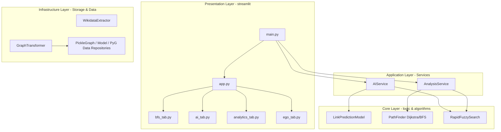

# 🕸️ Social Link Prediction (GNN & Wikidata)

[](https://www.python.org/)
[](https://pytorch.org/)
[](https://pytorch-geometric.readthedocs.io/)
[](https://igraph.org/)

---

## 📌 Table of Contents / Mục lục
1. [English Version (System Specification & Guide)](#-english-version)
2. [Bản tiếng Việt (Báo cáo Kỹ thuật & Hướng dẫn)](#-ban-tieng-viet)

---

# 🇬🇧 English Version

An advanced social network analysis system leveraging **Heterogeneous Graph Neural Networks (GNN)** and graph structural algorithms. The system extracts real-world knowledge graphs from the **Wikidata API**, processes high-dimensional attributes through an automated **Data Engineering pipeline**, and deploys deep learning models to predict hidden or future relationships (spouses, colleagues, employers, education) between entities.

---

## 🏗️ System Architecture (Clean Architecture)

The project adheres to the strict principles of **Clean Architecture** to ensure modularity, scalability, and testability across layers:



---

## 📊 Data Engineering Pipeline (ETL)

The automated ETL pipeline manages high-scale knowledge graph ingestion:

### 1. Extraction
* Developed a robust **SPARQL Wrapper** ([extractor.py](file:///c:/Users/nguye/social-link-prediction/infrastructure/pipelines/extractor.py)) to fetch data from the live Wikidata endpoint.
* Implemented a **birth interval scanning** mechanism. Querying data in batches based on birth years prevents API rate limits and timeouts.
* Formulated semantic queries in [queries.py](file:///c:/Users/nguye/social-link-prediction/config/queries.py) for relations including: `spouse`, `employer`, `educated_at`, and `colleague`.

### 2. Transformation & Cleansing
* Managed anomalies in [transformer.py](file:///c:/Users/nguye/social-link-prediction/infrastructure/pipelines/transformer.py): cleaned duplicate edges, normalized bidirectional relationships, resolved null birth years, and eliminated self-loops.
* Serialized processed entities into highly optimized **Apache Parquet** tables to achieve maximum I/O throughput.

### 3. Feature Engineering & HeteroData Construction
* **Semantic Encoding**: Embedded multi-lingual node text attributes (name, description, occupation, birthplace, gender, country) into a **384-dimensional dense vector** using the pre-trained Sentence-BERT (`paraphrase-multilingual-MiniLM-L12-v2`) model.
* **Structural Engineering**: 
  * Computed **Multi-view PageRank** scores for each edge type using the C-core `igraph` library.
  * Computed global **node degrees** and applied a log-transform (`log1p`) to mitigate the outsized influence of major hubs.
* **Temporal Features**: Scaled birth years using Min-Max normalization and created a binary indicator flag for missing values.
* **Feature Concat**: Consolidated all properties into a unified **432-dimensional** node feature tensor:
  $$\mathbf{x}_{node} = [\mathbf{v}_{SBERT(384)} \parallel v_{year(1)} \parallel v_{missing\_flag(1)} \parallel \mathbf{v}_{PageRank(45)} \parallel v_{degree(1)}]$$
* **PyG Loading**: Constructed PyTorch Geometric `HeteroData` by mapping raw Wikidata QIDs to local, 0-indexed PyG typed integer indices.

---

## 🤖 Graph Neural Network (GNN) Modeling

The deep learning model is developed using **PyG** to predict pairwise link probabilities on heterogeneous graphs.

### 1. Inductive Encoder (GraphSAGE)
* Employed a message-passing **GraphSAGE** architecture to support inductive learning. The model generalizes to unseen nodes at inference time without requiring full retraining.
* Wrapped layers with PyG's `to_hetero` wrapper using **sum** aggregation to compile representations across multiple incoming edge types.
* Integrated **LayerNorm** and a **40% dropout** rate to guarantee stable convergence.

### 2. Deep Interaction Decoder (InteractionMLP)
* Designed a custom **InteractionMLP** to compute coupling probabilities between node embeddings:
  $$\mathbf{h}_{pair} = [\mathbf{z}_{src} \parallel \mathbf{z}_{dst} \parallel (\mathbf{z}_{src} \odot \mathbf{z}_{dst})]$$
  Where $\mathbf{z}_{src} \odot \mathbf{z}_{dst}$ is the Hadamard product. Incorporating this product enables the MLP to capture fine-grained relational interactions.
* Placed a **Sigmoid** activation function at the output layer to map scores directly to connection probabilities in $[0.0, 1.0]$.

### 3. Structural Constraints & Graph Pathfinding
* **Taboo Filters**: Hard-coded structural rules to filter out family relations (sibling, parent) during spouse recommendations.
* **Age Gap Penalty**: Automatically penalizes GNN link scores or increases Dijkstra edge weights when the age gap between individuals exceeds 20 years.
* **Hub Penalty**: Dijkstra edge costs are computed as:
  $$w_{edge} = \log(\text{in\_degree} + 1)$$
  This pushes path searches to bypass broad hubs (e.g., country nodes) in favor of high-quality interpersonal pathways.

---

## 🖥️ Streamlit Interactive UI Tabs

1. **✈️ Six Degrees of Separation (BFS)**: Computes the shortest path between any two individuals, displaying a visual timeline and an interactive network using **pyvis**.
2. **🔮 Pairwise Link Prediction**: Evaluates two nodes and displays a probability bar chart for all relationships in real-time.
3. **👑 Connection & Spouse Advisor**: Recommends partners using GNN scores and hard constraints (age limits, taboo checks, gender filters).
4. **📊 Network Analytics**: Visualizes node degree distributions and maps top PageRank centrality nodes using stylized HTML cards.
5. **🔍 Ego Network Explorer**: Renders the 1-degree neighborhood surrounding a central node inside a dynamic, physics-enabled network.

---

## 🛠️ Installation & Usage

### 1. Install Dependencies
```bash
pip install -r requirements.txt
```

### 2. Launch Streamlit Web UI
```bash
streamlit run main.py
```

### 3. Utility CLI Commands
* **Run ETL Pipeline**: `python main.py --etl`
* **Train GNN Model**: `python main.py --train`

---

# 🇻🇳 Bản tiếng Việt

Hệ thống **Social Link Prediction** là giải pháp phân tích mạng lưới xã hội nâng cao, tích hợp công nghệ **Học sâu đồ thị (Graph Neural Networks - GNN)** dị thể và các thuật toán cấu trúc đồ thị tối ưu. Dự án thu thập dữ liệu tri thức thế giới thực từ **Wikidata API**, xử lý kỹ thuật dữ liệu quy mô lớn (Data Engineering), và xây dựng mô hình AI dự đoán các mối quan hệ ẩn hoặc tiềm năng tương lai giữa các thực thể (người dùng, tổ chức, trường học...).

---

## 🏗️ Kiến trúc Hệ thống (Clean Architecture)

Hệ thống được thiết kế và triển khai chặt chẽ theo nguyên lý **Kiến trúc Sạch (Clean Architecture)** nhằm đảm bảo tính module hóa, độc lập và dễ dàng mở rộng:

* **Presentation Layer (Lớp Giao diện)**: Xây dựng bằng Streamlit, bao gồm 4 Tab nghiệp vụ trực quan hóa cao kết hợp thư viện đồ thị động PyVis.
* **Application Layer (Lớp Nghiệp vụ Service)**: [ai_service.py](file:///c:/Users/nguye/social-link-prediction/application/ai_service.py) và [analysis_service.py](file:///c:/Users/nguye/social-link-prediction/application/analysis_service.py) đóng vai trò điều hợp luồng dữ liệu và thuật toán.
* **Core Logic Layer (Lớp Lõi thuật toán)**: Chứa định nghĩa mô hình GNN, thuật toán BFS/Dijkstra tối ưu trọng số và bộ máy tìm kiếm mờ Fuzzy Search sử dụng `rapidfuzz`.
* **Infrastructure Layer (Lớp Hạ tầng ETL)**: Quản lý trích xuất dữ liệu từ Wikidata, làm sạch và lưu trữ đồ thị thông qua các Repositories.

---

## 📊 Quy trình Kỹ nghệ Dữ liệu (Data Engineering Pipeline)

Hệ thống sở hữu một pipeline xử lý dữ liệu (ETL) hoàn chỉnh, khép kín và tự động hóa cao:

### 1. Extraction (Trích xuất tri thức)
* Sử dụng **SPARQL Wrapper** ([extractor.py](file:///c:/Users/nguye/social-link-prediction/infrastructure/pipelines/extractor.py)) để truy vấn trực tiếp từ endpoint Wikidata.
* Cơ chế **quét theo khoảng thời gian sinh (birth interval)** giúp tải dữ liệu theo từng lô (batch) song song, tránh bị giới hạn băng thông (rate limit) hoặc timeout của Wikidata API.
* Định nghĩa các câu truy vấn ngữ nghĩa phức tạp trong [queries.py](file:///c:/Users/nguye/social-link-prediction/config/queries.py) cho nhiều loại mối quan hệ: học tập (`educated_at`), làm việc (`employer`), hôn nhân (`spouse`), đồng nghiệp (`colleague` / `member_of_sports_team` / `acted_in`).

### 2. Transformation & Cleansing (Lọc & Chuẩn hóa)
* **Dọn dẹp và chuẩn hóa dữ liệu** ([transformer.py](file:///c:/Users/nguye/social-link-prediction/infrastructure/pipelines/transformer.py)): Loại bỏ các nút rác, xử lý giá trị khuyết thiếu ở cột năm sinh, giới tính và mô tả.
* **Lọc cạnh trùng lặp & cạnh ngược**: Loại bỏ các cạnh trùng lặp, chuẩn hóa hướng cạnh và tạo các cạnh nghịch đảo (`rev_`) tự động để chuyển đổi đồ thị thành dạng vô hướng khi cần thiết.
* Lưu trữ dữ liệu làm sạch dưới định dạng **Apache Parquet** tối ưu hóa tốc độ ghi đọc và dung lượng lưu trữ.

### 3. Feature Engineering & PyG HeteroData Construction (Kỹ nghệ Đặc trưng)
* **Đặc trưng Ngữ nghĩa (Semantic Features)**: Sử dụng mô hình Transformer ngôn ngữ đa quốc gia **Sentence-BERT** (`paraphrase-multilingual-MiniLM-L12-v2`) mã hóa thông tin thuộc tính dạng text của nút (tên, mô tả, nghề nghiệp, nơi sinh, quốc gia...) thành một dense vector **384 chiều**.
* **Đặc trưng Cấu trúc (Structural Features)**: 
  * Sử dụng thư viện đồ thị C-Core **igraph** tính toán chỉ số **Multi-view PageRank** theo từng loại cạnh riêng biệt.
  * Tính toán **Bậc kết nối toàn cục (Total Degree)** của các nút và chuẩn hóa Log-transform (`log1p`) để triệt tiêu ảnh hưởng của các nút ngoại lai (outliers / hubs cực lớn).
* **Đặc trưng Thời gian**: Chuẩn hóa Min-Max năm sinh và tạo vector cờ nhị phân đánh dấu giá trị năm sinh bị khuyết thiếu.
* **Hợp nhất vector đặc trưng (Feature Concat)**: Tạo ra vector đặc trưng nút hợp nhất **432 chiều**:
  $$\mathbf{x}_{node} = [\mathbf{v}_{SBERT(384)} \parallel v_{year(1)} \parallel v_{missing\_flag(1)} \parallel \mathbf{v}_{PageRank(45)} \parallel v_{degree(1)}]$$
* **Khởi tạo Đồ thị Dị thể (Heterogeneous Graph)**: Map index ID dạng chuỗi (QID) sang local index dạng số nguyên của PyTorch Geometric (PyG), lọc các quan hệ có quá ít cạnh (`MIN_EDGE_COUNT`) để tránh nhiễu và đóng gói thành đối tượng `HeteroData`.

---

## 🤖 Mô hình Dự đoán AI (Graph Neural Network - GNN)

Mô hình học máy chính được triển khai bằng **PyTorch Geometric (PyG)**, áp dụng kiến trúc mạng tích chập đồ thị dị thể để học nhúng cấu trúc và ngữ nghĩa.

### 1. Cơ chế Encoder (GraphSAGE)
* Sử dụng mạng **GraphSAGE (Sample and Aggregate)** kế thừa sức mạnh học quy nạp (inductive learning). Mô hình có thể dự đoán nhúng cho cả các nút mới hoàn toàn (unseen nodes) khi có thông tin đặc trưng mà không cần huấn luyện lại từ đầu.
* Phép biến đổi dị thể được gói bằng hàm `to_hetero` của PyG, sử dụng cơ chế gom tụ **sum** để tổng hợp thông tin từ nhiều loại quan hệ khác nhau truyền đến nút đích.
* Áp dụng chuẩn hóa **LayerNorm** và dropout **40%** giữa các lớp tích chập đồ thị nhằm chống hiện tượng quá khớp (overfitting) và triệt tiêu gradient (vanishing gradients).

### 2. Cơ chế Decoder (InteractionMLP)
* Thay vì chỉ thực hiện nhân vô hướng (Dot Product) hoặc khoảng cách Cosine thông thường giữa hai vector nhúng, hệ thống thiết kế một **InteractionMLP** tối ưu để giải mã điểm số liên kết.
* Vector đầu vào của mạng MLP được gộp (concatenate) từ 3 thành phần đặc trưng:
  $$\mathbf{h}_{pair} = [\mathbf{z}_{src} \parallel \mathbf{z}_{dst} \parallel (\mathbf{z}_{src} \odot \mathbf{z}_{dst})]$$
  Trong đó $\mathbf{z}_{src} \odot \mathbf{z}_{dst}$ là tích Hadamard (Hadamard product), giúp mô hình nắm bắt cực kỳ nhạy bén độ tương đồng và sự tương tác mạnh mẽ giữa hai biểu diễn nhúng thực thể trong không gian ẩn.
* Điểm số đầu ra được ép qua hàm **Sigmoid** để đưa về khoảng xác suất $[0.0, 1.0]$.

### 3. Ràng buộc Logic cứng (Hard Constraints) & Phạt Hub (Hub Penalty)
Để kết quả dự đoán GNN (Soft Constraint) thực tế và có ý nghĩa xã hội nhất, hệ thống tích hợp thêm:
* **Bộ lọc Cấm kỵ Huyết thống (Taboo Constraints)**: Loại bỏ các gợi ý kết hôn (`spouse`) nếu hai thực thể đã tồn tại mối quan hệ gia đình trực hệ trong đồ thị gốc (cha, mẹ, anh, chị, em).
* **Phạt chênh lệch tuổi tác (Age Gap Penalty)**: Tự động phạt điểm số liên kết hoặc tăng trọng số đường đi Dijkstra nếu chênh lệch tuổi tác giữa hai thực thể vượt quá ngưỡng cho phép (ví dụ: cách nhau trên 20 tuổi).
* **Phạt Hub Trung tâm (Hub Penalty)**: Trọng số đường đi Dijkstra qua một đỉnh được tính theo logarit của bậc vào (in-degree):
  $$w_{edge} = \log(\text{in\_degree} + 1)$$
  Giúp thuật toán tìm đường đi BFS/Dijkstra thông minh tránh đi qua các nút quá lớn (như quốc gia, tập đoàn lớn) để tìm ra các liên kết cá nhân thực sự chất lượng.

---

## 🖥️ Giao diện Tương tác Streamlit Dashboard

1. **✈️ Sáu Bậc Xa Cách (Degrees of Separation)**: Tìm đường đi liên kết ngắn nhất giữa hai người dùng bất kỳ. Trực quan hóa sơ đồ Timeline và mạng lưới động dạng bóng nẩy kéo thả bằng **PyVis**.
2. **🔮 Dự đoán Liên kết AI (GNN Pairwise)**: Nhập hai thực thể để phân tích và vẽ biểu đồ xác suất của tất cả mối quan hệ tiềm năng giữa họ.
3. **👑 Gợi ý kết nối thông minh**: Tìm kiếm các đối tác tiềm năng hoặc gợi ý vợ/chồng kết hợp GNN Soft Constraints và các bộ lọc logic cứng về giới tính, tuổi tác, huyết thống.
4. **📊 Thống kê mạng lưới (Network Analytics)**: Hiển thị thống kê quy mô đồ thị, vẽ biểu đồ phân bố bậc (Degree Distribution) và xếp hạng Top 10 thực thể có tầm ảnh hưởng lớn nhất qua thuật toán **PageRank Centrality**.
5. **🔍 Khám phá lân cận (Ego Network)**: Vẽ biểu đồ mạng lưới các quan hệ trực tiếp (bậc 1) xung quanh một thực thể chỉ định bằng bong bóng động tương tác.

---

## 🛠️ Hướng dẫn Khởi chạy nhanh

### 1. Cài đặt các thư viện cần thiết
```bash
pip install -r requirements.txt
```

### 2. Khởi chạy Dashboard Streamlit
```bash
streamlit run main.py
```

### 3. Các lệnh CLI Tiện ích (ETL & Huấn luyện)
* **Quy trình ETL thu thập dữ liệu Wikidata**: `python main.py --etl`
* **Quy trình Huấn luyện lại mô hình GNN**: `python main.py --train`

---

## 📁 Cấu trúc Thư mục Dự án

* **/config**: Các tệp cấu hình đường dẫn hằng số và Wikidata SPARQL Queries.
* **/core**: Lớp lõi thuật toán & AI (GNN, BFS/Dijkstra tối ưu, Fuzzy Search).
* **/infrastructure**: Pipelines ETL Wikidata (Extractor/Transformer) và các repositories lưu trữ.
* **/application**: Lớp phối hợp nghiệp vụ (AIService, AnalysisService).
* **/presentation**: Streamlit Web UI và mã nguồn render 4 Tab nghiệp vụ chính.
* **/scripts**: Điểm khởi chạy chạy độc lập hoặc CLI (ETL, train_model).

---

## 👥 Thành viên Thực hiện (Credits)

Dự án được nghiên cứu và phát triển bởi Nhóm 3 - Môn học Python cho Khoa học Dữ liệu - Trường Đại học Khoa học Tự nhiên, ĐHQG-HCM:
* **Nguyễn Minh Quang** - [minhquang0407](https://github.com/minhquang0407)
* **Đinh Nhật Tân** - [Hecquyn175](https://github.com/Hecquyn175)
* **Nguyễn Quốc Anh Quân** - [nqaq2005](https://github.com/nqaq2005)
