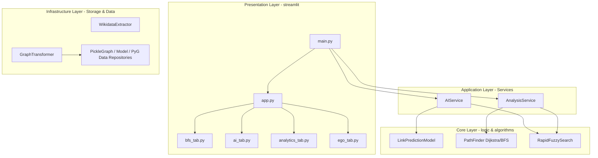

# Social Link Prediction (GNN & Wikidata)

[](https://www.python.org/)
[](https://pytorch.org/)
[](https://pytorch-geometric.readthedocs.io/)
[](https://igraph.org/)

---

## Table of Contents / Mục lục
1. [English Version (System Specification & Guide)](#english-version)
2. [Bản tiếng Việt (Báo cáo Kỹ thuật & Hướng dẫn)](#ban-tieng-viet)

---

# English Version

An advanced social network analysis system leveraging Heterogeneous Graph Neural Networks (GNN) and graph structural algorithms. The system extracts real-world knowledge graphs from the Wikidata API, processes high-dimensional attributes through an automated Data Engineering pipeline, and deploys deep learning models to predict hidden or future relationships (spouses, colleagues, employers, education) between entities.

---

## Project Context and Objectives

In the digital knowledge era, Knowledge Graphs (KGs) like Wikidata serve as the backbone for modern AI systems. However, these graphs often suffer from incomplete and sparse relations, representing "knowledge shadows". 

This project implements a hybrid Neuro-Symbolic AI approach that combines:
* **Symbolic Reasoning**: Logical and structural path calculations using C-Core graph algorithms (igraph).
* **Neural representation**: Implicit deep learning over continuous vector spaces using Heterogeneous Graph Neural Networks (GNN).

---

## System Architecture (Clean Architecture)

The project adheres to the strict principles of Clean Architecture to ensure modularity, scalability, and testability across layers:



---

## Data Engineering Pipeline (ETL)

The automated ETL pipeline manages high-scale knowledge graph ingestion:

### 1. Ingestion & Multi-Stage Extraction
* Developed a robust SPARQL Wrapper ([extractor.py](file:///c:/Users/nguye/social-link-prediction/infrastructure/pipelines/extractor.py)) to fetch structured RDF Triples, T = (Subject, Predicate, Object), from the live Wikidata endpoint.
* Implemented a birth interval scanning mechanism. Querying data in parallel batches based on birth years (e.g., 5-year buckets) prevents API rate limits and timeouts.
* Formulated semantic queries in [queries.py](file:///c:/Users/nguye/social-link-prediction/config/queries.py) for relations including: `educated_at`, `work_at`, `award_received`, `father`, `mother`, `spouse`, `employer`, and `colleague`.

### 2. Transformation, Cleansing & Deduplication
* Managed anomalies in [transformer.py](file:///c:/Users/nguye/social-link-prediction/infrastructure/pipelines/transformer.py): resolved self-loops, normalized bidirectional relations, cleaned duplicate edges using mapped keys `(id_min + "_" + id_max + "_" + relation)`, and computed missing values (imputation on birth year).
* Serialized processed entities into highly optimized Apache Parquet tables to achieve maximum I/O throughput and clean structure.

### 3. Graph Scale and Topological Statistics
* **Dataset Scale**:
  * **Nodes**: 4,609,521 entities (including 3,247,681 `human` nodes, 438,293 `written_work` nodes, 315,908 `film` nodes, etc. spanning 11 total types).
  * **Edges**: 10,761,807 active connections spanning 44 relationship categories (dominated by `educated_at` with 1,714,215 edges and `work_at` with 1,669,322 edges).
* **CCDF & Power-Law Exponent**:
  * Analysis of the Cumulative Complementary Distribution Function (CCDF) on a Log-Log scale shows a scale-free topology.
  * The Power-Law exponent estimated via Maximum Likelihood Estimation (MLE) yields:
    
    `gamma = 1 + n * [ sum( ln(k_i / (k_min - 0.5)) ) ]^-1`
    
    Setting the cut-off `k_min = 100` yields `gamma = 3.35`, showing that the graph is scale-free with tiptoeing properties resembling a random-like network since super-connected hubs do not completely centralize the entire connectivity.

### 4. Feature Engineering & PyG HeteroData Construction
* **Semantic Encoding**: Embedded multi-lingual node text attributes (name, description, occupation, birthplace, gender, interests) into a 384-dimensional dense vector using the pre-trained Sentence-BERT (`paraphrase-multilingual-MiniLM-L12-v2`) model.
* **Structural Engineering**: 
  * Computed Multi-view PageRank scores (45 distinct views based on different relationship categories) using the C-core `igraph` library.
  * Computed global node degrees and applied a log-transform (`log1p`) to mitigate the outsized influence of major hubs.
* **Temporal Features**: Scaled birth years using Min-Max normalization and created a binary indicator flag for missing values.
* **Feature Concat**: Consolidated all properties into a unified 432-dimensional node feature tensor:
  
  `x_node = [ v_SBERT(384) || v_year(1) || v_missing_flag(1) || v_PageRank(45) || v_degree(1) ]`
  
* **PyG Loading**: Constructed PyTorch Geometric `HeteroData` by mapping raw Wikidata QIDs to local, 0-indexed PyG typed integer indices.

---

## Graph Neural Network (GNN) Modeling

The GNN model is developed using PyG to predict pairwise link probabilities on heterogeneous graphs.

### 1. Inductive Encoder (GraphSAGE)
* Employed a message-passing GraphSAGE architecture to support inductive learning. The model generalizes to unseen nodes at inference time without requiring full retraining.
* Wrapped layers with PyG's `to_hetero` wrapper using sum aggregation to compile representations across multiple incoming edge types.
* Integrated LayerNorm and a 40% dropout rate to guarantee stable convergence.

### 2. Deep Interaction Decoder & Shared Decoder Mechanism
* **Shared Decoder Mechanism**: Decoders are keyed by relation type `__rel__` rather than `src__rel__dst`. Edge types that share the same relation name (e.g., spouses or colleagues of different entity subtypes) share the same decoder parameters. This reduces model size, prevents overfitting, and enables collaborative representation learning across different sub-graphs.
* **InteractionMLP Decoder**: Designed a custom InteractionMLP to compute coupling probabilities between node embeddings:
  
  `h_pair = [ z_src || z_dst || (z_src * z_dst) ]`
  
  Where `*` is the Hadamard product (element-wise multiplication). Incorporating this product enables the MLP to capture fine-grained relational interactions.
* Placed a Sigmoid activation function at the output layer to map scores directly to connection probabilities in `[0.0, 1.0]`.

### 3. Structural Constraints & Graph Pathfinding
* **Degrees of Separation (Social Distance)**: Defined specifically on nodes of type `human`, calculating the number of human steps separating two individuals, matching the "Six Degrees of Separation" theorem.
* **Taboo Filters**: Hard-coded structural rules to filter out family relations (sibling, father, mother) during spouse recommendations.
* **Age Gap Penalty**: Automatically penalizes GNN link scores or increases Dijkstra edge weights when the age gap between individuals exceeds 20 years.
* **Hub Penalty**: Dijkstra edge costs are computed as:
  
  `w_edge = log(in_degree + 1)`
  
  This pushes path searches to bypass broad hubs (e.g., country nodes) in favor of high-quality interpersonal pathways.

---

## Streamlit Interactive UI Tabs

1. **Six Degrees of Separation (BFS)**: Computes the shortest path between any two individuals, displaying a visual timeline and an interactive network using pyvis.
2. **Pairwise Link Prediction**: Evaluates two nodes and displays a probability bar chart for all relationships in real-time.
3. **Connection & Spouse Advisor**: Recommends partners using GNN scores and hard constraints (age limits, taboo checks, gender filters).
4. **Network Analytics**: Visualizes node degree distributions, scale-free power law, and maps top PageRank centrality nodes using stylized HTML cards.
5. **Ego Network Explorer**: Renders the 1-degree neighborhood surrounding a central node inside a dynamic, physics-enabled network.

---

## Installation & Usage

### 1. Install Dependencies
```bash
pip install -r requirements.txt
```

### 2. Launch Streamlit Web UI
```bash
streamlit run main.py
```

### 3. Utility CLI Commands
* **Run ETL Pipeline**: `python main.py --etl`
* **Train GNN Model**: `python main.py --train`

---

# Bản tiếng Việt

Hệ thống **Social Link Prediction** là giải pháp phân tích mạng lưới xã hội nâng cao, tích hợp công nghệ **Học sâu đồ thị (Graph Neural Networks - GNN)** dị thể và các thuật toán cấu trúc đồ thị tối ưu. Dự án thu thập dữ liệu tri thức thế giới thực từ **Wikidata API**, xử lý kỹ thuật dữ liệu quy mô lớn (Data Engineering), và xây dựng mô hình AI dự đoán các mối quan hệ ẩn hoặc tiềm năng tương lai giữa các thực thể (người dùng, tổ chức, trường học...).

---

## Bối cảnh và Mục tiêu dự án

Trong kỷ nguyên tri thức số, các Đồ thị Tri thức như Wikidata đóng vai trò là "xương sống" cho các hệ thống Trí tuệ nhân tạo hiện đại. Tuy nhiên, các hệ thống này đang đối mặt với "Vùng tối tri thức" – nơi các mối quan hệ xã hội thực tế tồn tại nhưng chưa được số hóa, dẫn đến tính không đầy đủ và thưa thớt của dữ liệu.

Đề tài này xây dựng giải pháp trên nền tảng kiến trúc lai **Neuro-Symbolic AI**, tối ưu hóa sự kết hợp giữa:
* **Symbolic (Biểu trưng)**: Khả năng suy luận logic cấu trúc đồ thị cực nhanh nhờ lõi C-Core (igraph).
* **Neural (Nơ-ron)**: Khả năng học biểu diễn ẩn mạnh mẽ của mạng nơ-ron đồ thị dị thể (GNN) trên không gian liên tục.

---

## Kiến trúc Hệ thống (Clean Architecture)

Hệ thống được thiết kế và triển khai chặt chẽ theo nguyên lý Kiến trúc Sạch (Clean Architecture) nhằm đảm bảo tính module hóa, độc lập và dễ dàng mở rộng:

* **Presentation Layer (Lớp Giao diện)**: Xây dựng bằng Streamlit, bao gồm 5 Tab nghiệp vụ trực quan hóa cao kết hợp thư viện đồ thị động PyVis.
* **Application Layer (Lớp Nghiệp vụ Service)**: [ai_service.py](file:///c:/Users/nguye/social-link-prediction/application/ai_service.py) và [analysis_service.py](file:///c:/Users/nguye/social-link-prediction/application/analysis_service.py) đóng vai trò điều hợp luồng dữ liệu và thuật toán.
* **Core Logic Layer (Lớp Lõi thuật toán)**: Chứa định nghĩa mô hình GNN, thuật toán BFS/Dijkstra tối ưu trọng số và bộ máy tìm kiếm mờ Fuzzy Search sử dụng `rapidfuzz`.
* **Infrastructure Layer (Lớp Hạ tầng ETL)**: Quản lý trích xuất dữ liệu từ Wikidata, làm sạch và lưu trữ đồ thị thông qua các Repositories.

---

## Quy trình Kỹ nghệ Dữ liệu (Data Engineering Pipeline)

Hệ thống sở hữu một pipeline xử lý dữ liệu (ETL) hoàn chỉnh, khép kín và tự động hóa cao:

### 1. Ingestion & Trích xuất đa giai đoạn (Extraction)
* Sử dụng SPARQL Wrapper ([extractor.py](file:///c:/Users/nguye/social-link-prediction/infrastructure/pipelines/extractor.py)) để truy vấn trực tiếp từ endpoint Wikidata dưới dạng bộ ba RDF T = (Chủ thể, Thuộc tính, Đối tượng).
* Cơ chế quét theo khoảng thời gian sinh (birth interval) song song tránh bị giới hạn băng thông (rate limit) hoặc timeout của Wikidata API.
* Định nghĩa các câu truy vấn ngữ nghĩa phức tạp trong [queries.py](file:///c:/Users/nguye/social-link-prediction/config/queries.py) cho nhiều loại mối quan hệ: học tập (`educated_at`), làm việc (`work_at`), giải thưởng (`award_received`), quan hệ gia đình (`father`, `mother`, `spouse`), và đồng nghiệp (`colleague` / `member_of_sports_team` / `acted_in`).

### 2. Biến đổi, Làm sạch & Lọc trùng (Transformation)
* Dọn dẹp và chuẩn hóa dữ liệu ([transformer.py](file:///c:/Users/nguye/social-link-prediction/infrastructure/pipelines/transformer.py)): Loại bỏ các vòng tự lặp (self-loops), xử lý giá trị khuyết thiếu ở cột năm sinh, giới tính và mô tả.
* Lọc cạnh trùng lặp & cạnh ngược bằng khóa tạo lập `(id_min + "_" + id_max + "_" + relation)` giúp đồ thị nhất quán.
* Lưu trữ dữ liệu làm sạch dưới định dạng Apache Parquet tối ưu hóa tốc độ ghi đọc và dung lượng lưu trữ.

### 3. Quy mô Đồ thị và Phân tích Topo chuyên sâu
* **Quy mô dữ liệu**:
  * **Đỉnh (Nodes)**: 4,609,521 thực thể (bao gồm 3,247,681 nút `human`, 438,293 nút `written_work`, 315,908 nút `film`... thuộc 11 loại nút khác nhau).
  * **Cạnh (Edges)**: 10,761,807 liên kết hoạt động thuộc 44 loại quan hệ (đứng đầu là `educated_at` với 1,714,215 cạnh và `work_at` với 1,669,322 cạnh).
* **Kiểm định Phân phối lũy thừa (Power-Law Exponent)**:
  * Vẽ biểu đồ phân bố bậc CDF/CCDF trên thang đo Log-Log. Hệ số mũ Power-law ước lượng bằng phương pháp Maximum Likelihood Estimation (MLE):
    
    `gamma = 1 + n * [ sum( ln(k_i / (k_min - 0.5)) ) ]^-1`
    
    Với ngưỡng tối thiểu `k_min = 100`, ta tính ra `gamma = 3.35`. Chỉ số này chứng minh mạng lưới có tính phi tỷ lệ nhưng tiệm cận mạng ngẫu nhiên (Random-like), do các siêu đỉnh (Hubs) chưa chiếm mật độ tuyệt đối để tập trung quyền lực đồ thị.

### 4. Kỹ nghệ Đặc trưng & Khởi tạo PyG HeteroData
* **Đặc trưng Ngữ nghĩa (Semantic Features)**: Sử dụng mô hình Transformer ngôn ngữ đa quốc gia Sentence-BERT (`paraphrase-multilingual-MiniLM-L12-v2`) mã hóa thông tin thuộc tính dạng text của nút (tên, mô tả, nghề nghiệp, nơi sinh, giới tính, sở thích...) thành một dense vector 384 chiều.
* **Đặc trưng Cấu trúc (Structural Features)**: 
  * Sử dụng thư viện đồ thị C-Core igraph tính toán chỉ số Multi-view PageRank (45 lượt trên từng loại cạnh) để ghi nhận thuộc tính cấu trúc ẩn.
  * Tính toán Bậc kết nối toàn cục (Total Degree) của các nút và chuẩn hóa Log-transform (`log1p`) để triệt tiêu ảnh hưởng của các nút ngoại lai.
* **Đặc trưng Thời gian**: Chuẩn hóa Min-Max năm sinh và tạo vector cờ nhị phân đánh dấu giá trị năm sinh bị khuyết thiếu.
* **Hợp nhất vector đặc trưng (Feature Concat)**: Tạo ra vector đặc trưng nút hợp nhất 432 chiều:
  
  `x_node = [ v_SBERT(384) || v_year(1) || v_missing_flag(1) || v_PageRank(45) || v_degree(1) ]`
  
* **Khởi tạo Đồ thị Dị thể (Heterogeneous Graph)**: Map index ID dạng chuỗi (QID) sang local index dạng số nguyên của PyTorch Geometric (PyG), lọc các quan hệ có quá ít cạnh để tránh nhiễu và đóng gói thành đối tượng `HeteroData`.

---

## Mô hình Dự đoán AI (Graph Neural Network - GNN)

Mô hình học máy chính được triển khai bằng PyTorch Geometric (PyG), áp dụng kiến trúc mạng tích chập đồ thị dị thể để học nhúng cấu trúc và ngữ nghĩa.

### 1. Cơ chế Encoder (GraphSAGE)
* Sử dụng mạng GraphSAGE (Sample and Aggregate) kế thừa sức mạnh học quy nạp (inductive learning). Mô hình có thể dự đoán nhúng cho cả các nút mới hoàn toàn (unseen nodes) khi có thông tin đặc trưng mà không cần huấn luyện lại từ đầu.
* Phép biến đổi dị thể được gói bằng hàm `to_hetero` của PyG, sử dụng cơ chế gom tụ sum để tổng hợp thông tin từ nhiều loại quan hệ khác nhau truyền đến nút đích.
* Áp dụng chuẩn hóa LayerNorm và dropout 40% giữa các lớp tích chập đồ thị nhằm chống hiện tượng quá khớp (overfitting) và triệt tiêu gradient (vanishing gradients).

### 2. Cơ chế Decoder & Cơ chế Shared Decoder
* **Cơ chế Shared Decoder**: Các bộ giải mã (decoders) được ánh xạ dựa trên khóa quan hệ dạng `__rel__` thay vì `src__rel__dst` riêng biệt. Các loại cạnh có chung tên mối quan hệ (ví dụ: vợ/chồng giữa các phân nhóm nút khác nhau) sẽ chia sẻ chung bộ trọng số giải mã. Điều này giúp tiết kiệm tài nguyên bộ nhớ, tránh hiện tượng overfitting và tăng cường khả năng học biểu diễn tương hỗ của GNN trên toàn đồ thị.
* **Bộ giải mã InteractionMLP**: Thay vì chỉ thực hiện nhân vô hướng (Dot Product) hoặc khoảng cách Cosine thông thường giữa hai vector nhúng, hệ thống thiết kế một InteractionMLP tối ưu để giải mã điểm số liên kết:
  
  `h_pair = [ z_src || z_dst || (z_src * z_dst) ]`
  
  Trong đó `z_src * z_dst` là tích Hadamard (nhân từng phần tử). Việc đưa tích Hadamard vào giúp mạng MLP nhận diện nhạy bén độ tương đồng và các tương tác phi tuyến tính giữa nguồn và đích.
* Điểm số đầu ra được ép qua hàm Sigmoid để đưa về khoảng xác suất `[0.0, 1.0]`.

### 3. Ràng buộc Logic cứng (Hard Constraints) & Phạt Hub (Hub Penalty)
* **Khoảng cách Xã hội (Bậc trung gian)**: Định nghĩa chỉ tính trên đỉnh loại `human` (người). Số bậc tương đương số lượng nút người làm cầu nối giữa hai thực thể, giúp kiểm chứng lý thuyết "Sáu bậc xa cách" trên thực tế.
* **Bộ lọc Cấm kỵ Huyết thống (Taboo Constraints)**: Loại bỏ các gợi ý kết hôn (`spouse`) nếu hai thực thể đã tồn tại mối quan hệ gia đình trực hệ trong đồ thị gốc (cha, mẹ, anh, chị, em).
* **Phạt chênh lệch tuổi tác (Age Gap Penalty)**: Tự động phạt điểm số liên kết hoặc tăng trọng số đường đi Dijkstra nếu chênh lệch tuổi tác giữa hai thực thể vượt quá ngưỡng cho phép (ví dụ: cách nhau trên 20 tuổi).
* **Phạt Hub Trung tâm (Hub Penalty)**: Trọng số đường đi Dijkstra qua một đỉnh được tính theo logarit của bậc vào (in-degree):
  
  `w_edge = log(in_degree + 1)`
  
  Giúp thuật toán tìm đường đi BFS/Dijkstra thông minh tránh đi qua các nút quá lớn (như quốc gia, tập đoàn lớn) để tìm ra các liên kết cá nhân thực sự chất lượng.

---

## Giao diện Tương tác Streamlit Dashboard

1. **Sáu Bậc Xa Cách (Degrees of Separation)**: Tìm đường đi liên kết ngắn nhất giữa hai người dùng bất kỳ. Trực quan hóa sơ đồ Timeline và mạng lưới động dạng bóng nẩy kéo thả bằng PyVis.
2. **Dự đoán Liên kết AI (GNN Pairwise)**: Nhập hai thực thể để phân tích và vẽ biểu đồ xác suất của tất cả mối quan hệ tiềm năng giữa họ.
3. **Gợi ý kết nối thông minh**: Tìm kiếm các đối tác tiềm năng hoặc gợi ý vợ/chồng kết hợp GNN Soft Constraints và các bộ lọc logic cứng về giới tính, tuổi tác, huyết thống.
4. **Thống kê mạng lưới (Network Analytics)**: Hiển thị thống kê quy mô đồ thị, vẽ biểu đồ phân bố bậc (Degree Distribution) và xếp hạng Top 10 thực thể có tầm ảnh hưởng lớn nhất qua thuật toán PageRank Centrality.
5. **Khám phá lân cận (Ego Network)**: Vẽ biểu đồ mạng lưới các quan hệ trực tiếp (bậc 1) xung quanh một thực thể chỉ định bằng bong bóng động tương tác.

---

## Hướng dẫn Khởi chạy nhanh

### 1. Cài đặt các thư viện cần thiết
```bash
pip install -r requirements.txt
```

### 2. Khởi chạy Dashboard Streamlit
```bash
streamlit run main.py
```

### 3. Các lệnh CLI Tiện ích (ETL & Huấn luyện)
* **Quy trình ETL thu thập dữ liệu Wikidata**: `python main.py --etl`
* **Quy trình Huấn luyện lại mô hình GNN**: `python main.py --train`

---

## Cấu trúc Thư mục Dự án

* **/config**: Các tệp cấu hình đường dẫn hằng số và Wikidata SPARQL Queries.
* **/core**: Lớp lõi thuật toán & AI (GNN, BFS/Dijkstra tối ưu, Fuzzy Search).
* **/infrastructure**: Pipelines ETL Wikidata (Extractor/Transformer) và các repositories lưu trữ.
* **/application**: Lớp phối hợp nghiệp vụ (AIService, AnalysisService).
* **/presentation**: Streamlit Web UI và mã nguồn render 5 Tab nghiệp vụ chính.
* **/scripts**: Điểm khởi chạy chạy độc lập hoặc CLI (ETL, train_model).

---

## Thành viên Thực hiện (Credits)

Dự án được nghiên cứu và phát triển bởi Nhóm 3 - Môn học Python cho Khoa học Dữ liệu - Trường Đại học Khoa học Tự nhiên, ĐHQG-HCM:
* **Nguyễn Minh Quang** - [minhquang0407](https://github.com/minhquang0407)
* **Đinh Nhật Tân** - [Hecquyn175](https://github.com/Hecquyn175)
* **Nguyễn Quốc Anh Quân** - [nqaq2005](https://github.com/nqaq2005)
